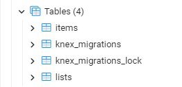

After creating our entities, setup the database and set databases credentials in configuration files. We will run a special `herbs-cli` command thats will generate migrations files in `src/infra/data/database/migrations`, repositories files in `src/infra/data/database/repositories`.

Let's run in terminal inside our project root:
```bash
herbs update
```

In this moment some magic happens 🎉!!
Now we can see our project structure folder it should be like this:

```bash
├── node_modules
├── package-lock.json
├── package.json
├── knexFile.js
└── src
    ├── index.js
    ├── domain
    │   ├── entities
    │   │   ├── Item.js
    │   │   └── List.js
    │   ├── usecases
    │   │   ├── item
    │   │   │    └── ...
    │   │   └── list
    │   │        └── ...
    │   └── herbarium.js 
    └── infra
        ├── api
        │   ├── graphql
        │   │   ├── index.js
        │   │   ├── queries.js
        │   │   ├── mutations.js
        │   │   └── types.js
        │   └── server.js      
        ├── config
        │   ├── api.js
        │   ├── index.js
        │   └── postgres.js
        ├── data
        │   └── database
        │       ├── migrations
        │       │   └── ...
        │       ├── repositories
        │       │   └── ...
        │       └── connection.js
        └── index.js
        
```

## Migrations

Migrations is basically a way to version your database. This looks amazing, is it like GIT?
Well, not so much. Migrations operate with three focuses: CREATE, CHANGE, and REMOVE.

That way we can make changes, create or even remove things from your database.
But when we say remove, we are not referring to the DELETE operation, to remove data, but the DROP operation, to delete a table.

### Running migrations

Running the command in the console

```bash
npm run knex:migrate
```
We have this result:



Four tables were created.
The tables referring to the `items` and `lists` project and two more tables to control `knex_migrations` and `knex_migrations_lock`

-- rodar migrations com knex [colinha](http://perkframework.com/v1/guides/database-migrations-knex.html)


## Repositories

A repository is a design pattern intended to decouple database code from your business logic.

This pattern bring some important benefits. First, makes your code easier to read and maintain, because database code is not spread throughout application. Second, the code becomes significantly easier to unit test. Its be easily mock repositories while testing your business logic instead of having to set up databases, tables and seeding them with data. And third, the business logic does not depend strongly on a specific database platform.

After `herbs update` run, its automatic create inside `src/infra/data/database/repositories`
a repository file for each entity we previous created.

These repositories files abstract `knex.js` to make queries in database and any class created in these files
will be exported for `herbarium.repositories`, so we will can access theses repositories inside any place in our application importing `herbarium`.

A repository file it should be like:
```javascript
// src/infra/data/database/repositories/itemRepository.js

const { Repository } = require("@herbsjs/herbs2knex")
const { herbarium } = require('@herbsjs/herbarium')
const Item = require('../../../domain/entities/item')
const connection = require('../database/connection')

class ItemRepository extends Repository {
    constructor(injection) {
        super({
            entity: Item,
            table: "items",
            knex: connection
        })
    }
}

module.exports =
    herbarium.repositories
        .add(ItemRepository, 'ItemRepository')
        .metadata({ entity: Item })
        .repository
```
